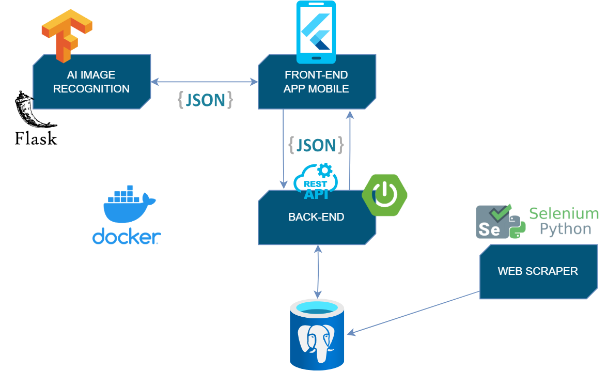

# CityWander

CityWander è un' applicazione sviluppata durante il corso Enteprise Mobile Application Development dell'Università Degli
Studi di Salerno, in collaborazione con l'azienda ITSvil.

L’obiettivo di CityWander è quello di offrire un'esperienza turistica personalizzata e informativa a Salerno,
che si adatti alle preferenze degli utenti e permetta di offrire una strutturazione culturale
(tramite la creazione di tour guidati) facilmente fruibile.

## Autori
- Di Lauro Francesco
- Di Mario Marco
- Arcangeli Giovanni
- Campochiaro Fabiano
## Funzionalità

 * **Gamification & Rewarding**:
La gamification, tramite il Rewarding e l’utilizzo di un assistente virtuale,  è una metodologia che favorisce il
coinvolgimento emotivo dell’utente
 * **Geofencing**: Utilizzo del geofencing per fornire esperienze basate sulla posizione in tempo reale
 * **Image Recognition**:  La capacità di riconoscere locali, semplicemente inquadrandoli, permettendo la fruizione di 
dettagli e menù relativi al locale

# Architettura
</br>

L'applicazione è stata sviluppata con Flutter versione 3.13.6 ed è compatibile con i vari dispositivi mobili come Android e IOS.
Entrambi i backend, sia quello in SpringBoot che quello su Flask, sono stati containerizzati utilizzando Docker,
questo per far si che il back-end della nostra applicazione possa risiedere su qualsiasi macchina, e possa essere scalabile.

## Backend
Il back-end dell'applicazione è realizzato in Spring Boot.
È stato utilizzato il framework MyBatis per il supporto alla persistenza su PostgreSQL.
Il controller layer del back-end fornisce API RESTful, che consentono di comunicare con l'applicazione Flutter mediante oggetti JSON.
Le API REST sono state testate grazie al tool Swagger.

## Frontend
Per le interfacce abbiamo realizzato delle bozze tramite Figma.
Per il passaggio da Figma a Flutter abbiamo utilizzato Function 12, un convertitore che ci ha permesso di velocizzare il passaggio tra i due programmi.
Per la realizzazione di loghi ed immagini abbiamo sfruttato Canva che ci ha permesso di realizzare grafiche come quelle del Principe Arechi.

## Web scraper
Il web scraper per estrarre informazioni sui ristoranti di Salerno da TripAdvisor è stato creato in Python utilizzando
la libreria Selenium. La combinazione di Python e Selenium offre flessibilità e automazione per ottenere varie informazioni sui ristoranti.
Al momento, la tecnologia è stata impiegata per popolare il database iniziale e per futuri inserimenti automatici di locali da parte degli esercenti.
Per migliorare i dati raccolti, è stato utilizzato un algoritmo di geocoding basato su Geoapify per convertire gli indirizzi dei ristoranti in coordinate geografiche.

## AI Image recognition
Il modulo di image recognition dell'app usa il transfer learning su ResNet50 per riconoscere le insegne dei ristoranti di Salerno.
Viene applicato il fine tuning per migliorare le performance e fare previsioni su immagini di input in formato .jpg. TensorFlow, Keras e Flask sono le principali librerie utilizzate.
Questo modulo di Image Recognition è stato integrato all’interno di un server Flask.
L'applicazione Flutter caricherà dunque l'immagine sul server per il riconoscimento usando un modello preaddestrato, restituendo infine la previsione.

# Installazione

## Backend
Compilare progetto utilizzando Maven e Java 17 (clean & install da Maven e il jar viene direttamente portato sull'environment)

Avviare i container Docker preconfigurati:

```
docker compose up -d
``` 

Se è necessario ricreare i container (es. query di inizializzazione PostgreSQL cambiate):

```
docker compose down -v
``` 

Una volta avviati i container, gli endpoint REST potranno essere testati tramite swagger:

Swagger -> http://localhost:13004/citywanderbackend/

DB -> http://localhost:13001/browser/

## Frontend

Flutter versione 3.13.6
```
flutter pub get
flutter pub upgrade
```
e avviare main.dart su emulatore o smartphone fisico.

## Image Recognition Backend
1) installare tutte le dipendenze richieste (Python v3.8)
2) creare l'immagine di docker:
```
docker image build -t imagerecognition .
```
3) run del container:
```
docker run -p 5000:5000 -d --name AIRecognition imagerecognition
```

L'API REST dell'image recognition (GET) prende come parametro (imageName) il nome di un'immagine, che dovrà essere stata caricata

in precedenza sul server (tramite l'API uploadImage) , e restituisce il nome del ristorante riconosciuto:

http://localhost:5000/imageRecognition?imageName=prova1.jpg
```
{"recognizedImage":"Ingordo"}
```
API per caricare un' immagine sul server:

Richiesta POST a

http://localhost:5000/uploadImage, con un parametro nel body 'image' che è il file effettivo dell'immagine.
Restituisce il nome del file appena caricato

